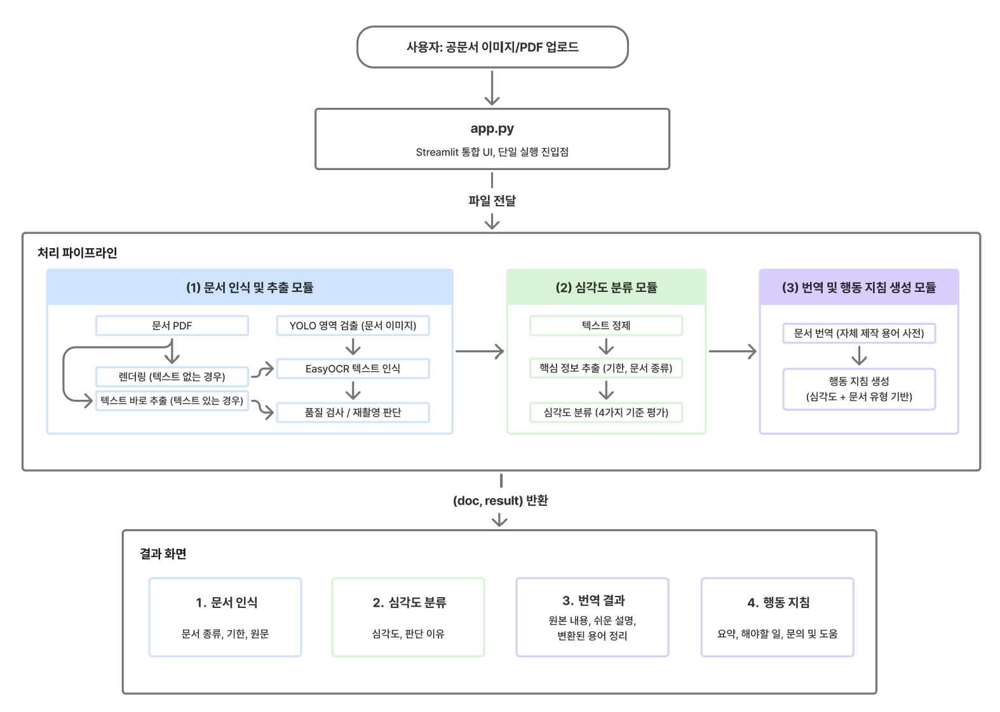
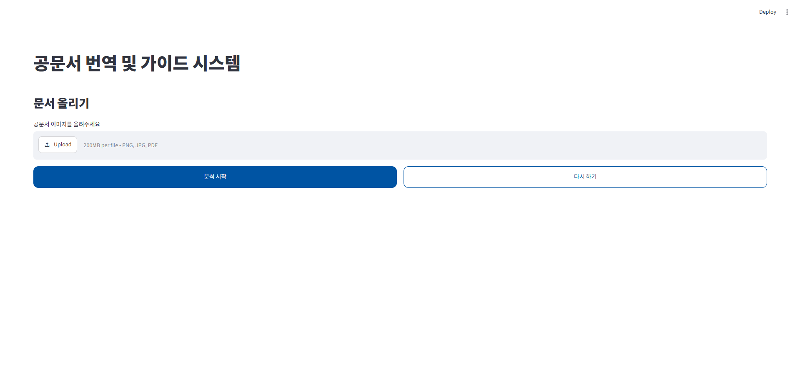
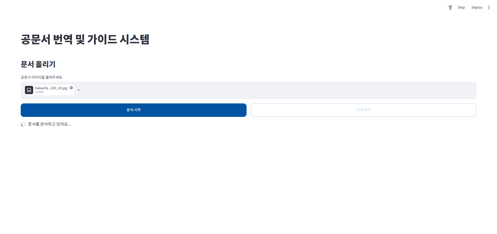
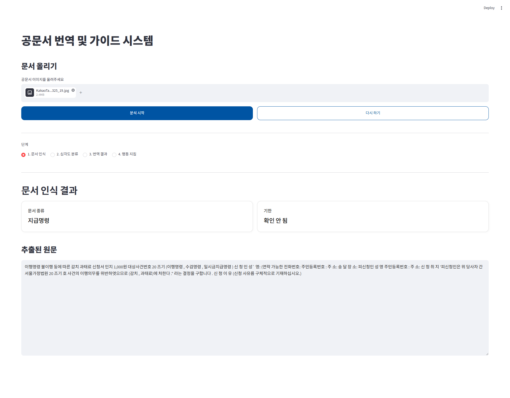
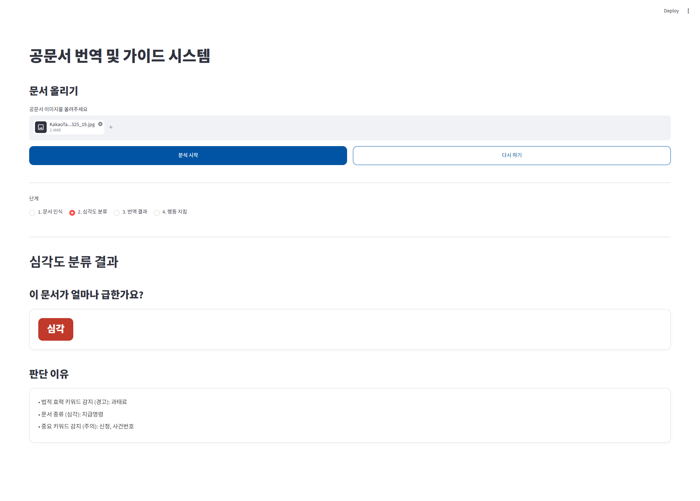
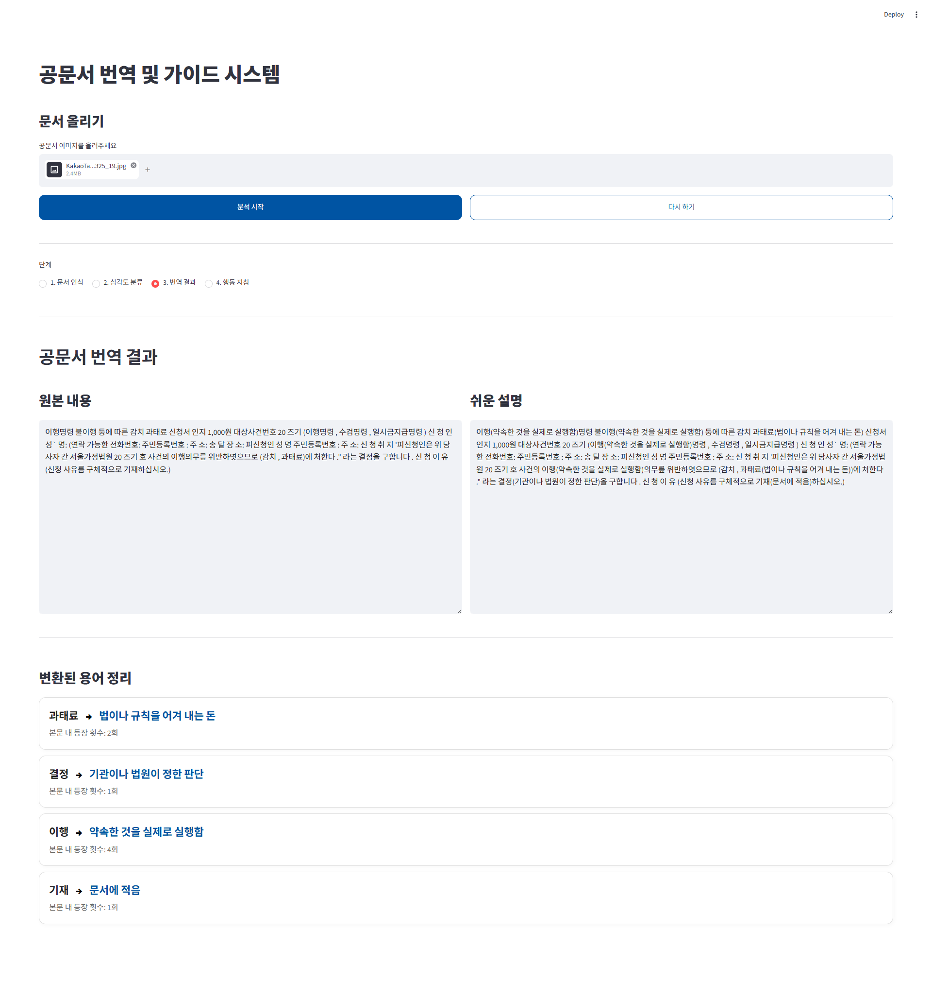
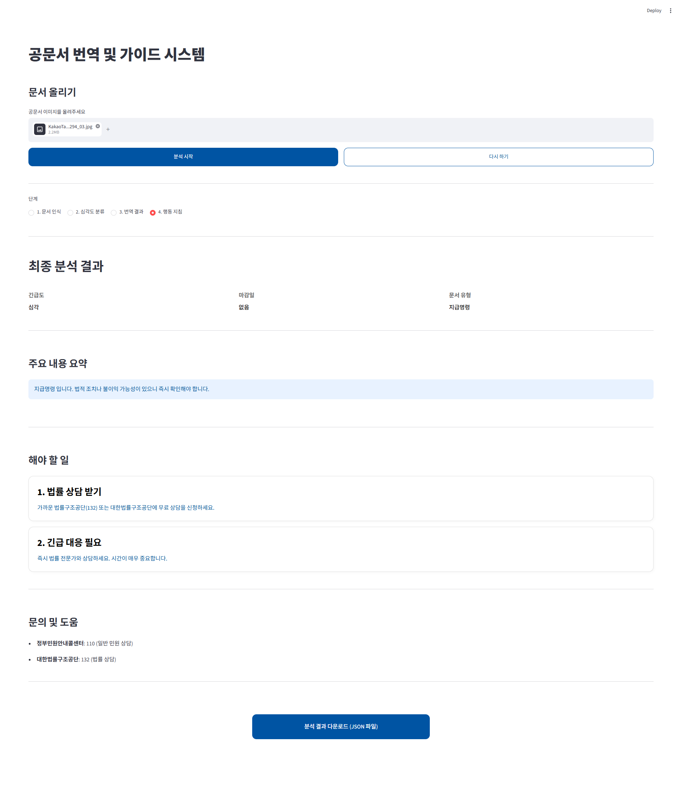

# official_doc_helper

#### 이서영, 강다연, 홍진서

오픈소스프로그래밍 프로젝트, 숙명여자대학교, 서울특별시, 대한민국

본 저장소는 공문서 번역 및 가이드 시스템의 공식 구현 저장소입니다.

---

## 프로젝트 개요

세금 고지서, 법원 통지서, 부동산 계약서와 같은 공문서는 한자어, 법률 용어, 복잡한 행정 표현 및 서식으로 구성되어 있어 일반 사용자가 내용을 정확히 이해하기 어렵다. 특히 정보 소외 계층의 경우 문서를 제대로 이해하지 못해 기한을 놓치거나 법적 불이익을 받는 사례가 빈번하게 발생한다. 이러한 문제는 개인의 피해에 그치지 않고 행정 민원 증가와 사회적 비용 발생으로 이어질 수 있다.

본 프로젝트는 이러한 문제를 해결하기 위해 공문서 번역 및 가이드 시스템을 개발하였다. 사용자는 종이 문서를 촬영하거나 전자 문서를 업로드할 수 있으며, 시스템은 문서 이미지를 인식하고 OCR을 통해 문서 내용을 추출한다. 이후 추출된 텍스트를 기반으로 문서의 심각도를 분석하고, 어려운 행정·법률 용어를 쉬운 표현으로 번역하며, 심각도에 따른 적절한 행동 지침을 제공한다.

본 시스템은 다음과 같은 세 가지 핵심 모듈로 구성된다.

- 문서 인식 및 추출 모듈

- 심각도 분류 모듈

- 번역 및 행동 지침 생성 모듈

이를 통해 누구나 공문서를 쉽게 이해하고 필요한 조치를 빠르게 판단할 수 있도록 지원하는 것을 목표로 한다.

#### 시스템 구조

<p align="center">
  
</p>

#### 실행 결과

- 초기 화면
    <p align="center">
    
    </p>

- 사진 삽입 시
    <p align="center">
    
    </p>

- 문서 인식 결과
    <p align="center">
    
    </p>

- 심각도 분류 결과
    <p align="center">
    
    </p>

- 번역 결과
    <p align="center">
    
    </p>

- 행동 지침 결과
    <p align="center">
    
    </p>

---

## 주요 기능

#### 문서 인식 및 추출 모듈

- OCR 기반 문서 텍스트 추출
- 이미지 및 전자 문서 업로드 지원

#### 심각도 분류 모듈

- 핵심 정보(기한, 문서 종류) 추출

- 문서의 다음 요소를 분석하여 심각도를 판단
    1. 제출 및 납부 기한

    2. 법적 효력 키워드

    3. 문서 종류

    4. 중요 키워드

- 최종적으로 다음 4단계로 분류

| 단계 | 설명                            |
| ---- | ------------------------------- |
| 심각 | 즉각적인 대응이 필요한 문서     |
| 경고 | 빠른 확인 및 대응이 필요한 문서 |
| 주의 | 확인이 필요한 문서              |
| 일반 | 일반 안내 수준의 문서           |

#### 번역 및 행동 지침 생성 모듈

- 어려운 행정 및 법률 용어를 쉬운 표현으로 변환
- 이해하기 쉬운 설명 제공
- 사용자 행동 가이드 제공

---

## 기대 효과

#### 기술적 기대 효과

- 공문서 특화 OCR 기술 확보
- 행정·법률 용어 쉬운 표현 변환 기술 확보
- 사용자 친화적 시각화 기능 구현

#### 사회적 기대 효과

- 정보 소외 계층의 정보 접근성 향상
- 법적·경제적 피해 예방
- 공공기관 민원 감소 및 행정 효율성 증가

---

## 시스템 실행 방법

#### 개발 환경 및 패키지

- Anaconda3
- Python 3.11
- Streamlit
- Ultralytics
- EasyOCR
- PyMuPDF
- OpenCV
- NumPy

#### 실행

1. Anaconda 가상환경 생성
    ```bash
    conda create -n official_doc_helper python=3.11
    ```
    
2. 가상환경 실행
    ```bash
    conda activate official_doc_helper
    ```
    
3. `official_doc_helper_integrated/` 폴더로 이동
    ```bash
    cd ./official_doc_helper_integrated/ # 폴더가 있는 경로에 맞게 수정
    ```
    
4. 패키지 설치
    ```bash
    pip install -r requirements.txt
    ```
    
5. `app.py` 실행
    ```bash
    streamlit run app.py
    ```

---

## 모델 학습 방법

---

## 기술 스택

| 구분             | 사용 기술           |
| ---------------- | ------------------- |
| Language         | Python              |
| UI               | Streamlit           |
| Object Detection | Ultralytics         |
| Image Processing | OpenCV, NumPy       |
| PDF Processing   | PyMuPDF             |
| OCR              | EasyOCR             |
| Collaboration    | Git, GitHub, Notion |

---

## 팀 구성

| 이름   | 담당                                                  |
| ------ | ----------------------------------------------------- |
| 이서영 | 데이터셋, 문서 인식 및 추출 모듈, 보안 및 데이터 관리 |
| 강다연 | 데이터셋, 번역 및 행동 지침 생성 모듈, 결과 화면 UI   |
| 홍진서 | 데이터셋, 심각도 분류 모듈, 입력 화면 UI              |
